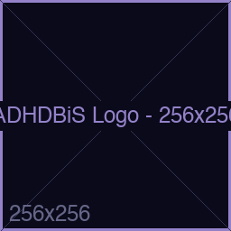
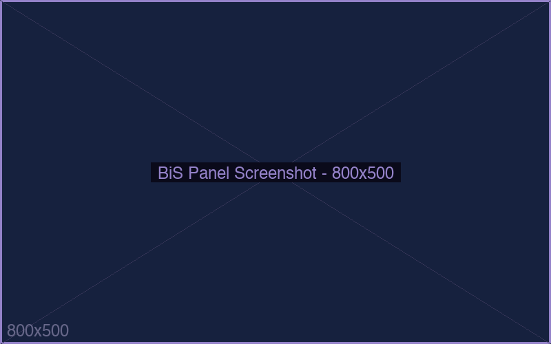
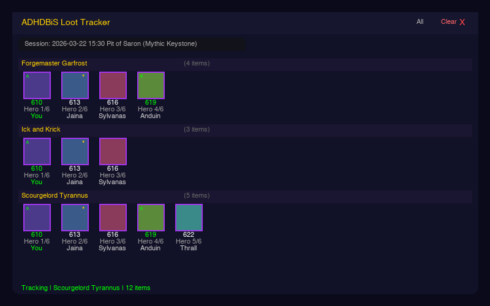

<p align="center">
  
</p>

<h1 align="center">ADHDBiS</h1>

<p align="center">
  <strong>Best in Slot gear tracker, loot tracker, and raid companion for World of Warcraft: Midnight</strong>
</p>

<p align="center">
  <a href="https://github.com/nenadjokic/ADHDBiS/releases/latest"></a>
  <a href="https://github.com/nenadjokic/ADHDBiS/releases"></a>
  <a href="https://www.curseforge.com/wow/addons/adhdbis"></a>
  <a href="https://adhd.jokicville.org"></a>
</p>

<p align="center">
  <a href="https://buymeacoffee.com/nenadjokic"></a>
  <a href="https://paypal.me/nenadjokicRS"></a>
</p>

---

<p align="center">
  
  
</p>

## Features

**BiS Gear Tracking**
- Two-column list view with item icons, names, drop sources, and ilvl
- 4-state status: equipped BiS, upgradeable, in bags, missing
- Overall, Raid, and M+ tabs with progress percentage
- Trinket rankings with S/A/B/C/D tier system
- Tooltip integration - hover any item anywhere to see if it's BiS
- Data from both **Icy Veins** and **Wowhead** with in-game source switching

**Loot Tracker**
- Real-time loot tracking in raids and dungeons
- Items appear in the roll window, then update with the winner
- Collapsible boss groups, bind type indicators, ilvl and gear track
- Session management with auto-naming, dropdown selector, rename
- Share and Save buttons for loot reports

**More**
- Wishlist system with golden glow and sound alerts on drops
- Enchants, gems, consumables grids for all specs
- Talent builds with copy-paste import strings
- LootRadar M+ upgrade scanner
- Great Vault weekly progress tracker
- Options panel via right-click minimap button
- All 13 classes, 40 specs supported

## Quick Start

| Step | Action |
|:----:|--------|
| **1** | Download `ADHDBiS.zip` from [Releases](https://github.com/nenadjokic/ADHDBiS/releases/latest) or [CurseForge](https://www.curseforge.com/wow/addons/adhdbis) and extract to `World of Warcraft/_retail_/Interface/AddOns/` |
| **2** | Download and run the **Companion App** for your platform (see below) |
| **3** | `/reload` in WoW, then `/adhd bis` to open the panel |

## Downloads

| Platform | Download |
|----------|----------|
| **WoW Addon** | [ADHDBiS.zip](https://github.com/nenadjokic/ADHDBiS/releases/latest/download/ADHDBiS.zip) |
| **Windows** | [adhdbis-updater.exe](https://github.com/nenadjokic/ADHDBiS/releases/latest/download/adhdbis-updater.exe) |
| **macOS (Apple Silicon)** | [adhdbis-updater-mac-arm64](https://github.com/nenadjokic/ADHDBiS/releases/latest/download/adhdbis-updater-mac-arm64) |
| **macOS (Intel)** | [adhdbis-updater-mac-amd64](https://github.com/nenadjokic/ADHDBiS/releases/latest/download/adhdbis-updater-mac-amd64) |
| **Linux** | [adhdbis-updater-linux](https://github.com/nenadjokic/ADHDBiS/releases/latest/download/adhdbis-updater-linux) |

> Double-click opens a web GUI. Use `--cli` flag for terminal mode.

## Commands

| Command | Description |
|---------|-------------|
| `/adhd bis` | Toggle BiS gear panel |
| `/adhd loot` | Toggle Loot Tracker |
| `/adhd loot new [name]` | Start a new loot session |
| `/adhd loot start` / `stop` | Resume / pause tracking |
| `/adhd loot summary` | Print session summary to chat |
| `/adhd loot wishlist` | Show all wishlisted items |
| `/adhd loot sound` | Change alert sound (10 options) |
| `/adhd loot help` | All loot tracker commands |
| `/adhd radar` | Toggle LootRadar (M+ upgrade scanner) |
| `/adhd minimap hide/show/reset` | Control minimap button |
| `/adhd version` | Show addon version |

**Item controls:** Click = Adventure Guide | Shift+Click = Link to chat | Right-Click = Wishlist | Shift+Right-Click = Wowhead URL

## Project Structure

```
ADHDBiS-monorepo/
  addon/          WoW addon (Lua)
  updater/        Companion app (Go) - scrapes Icy Veins & Wowhead
  www/            Website & changelog
```

## Support the Project

ADHDBiS is free and open source. If it makes your WoW experience better, consider supporting continued development:

<p align="center">
  <a href="https://buymeacoffee.com/nenadjokic"></a>
  <a href="https://paypal.me/nenadjokicRS"></a>
</p>

## License

MIT
